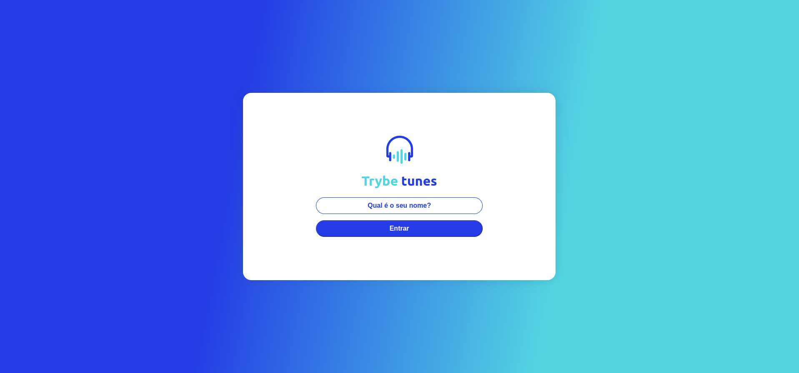
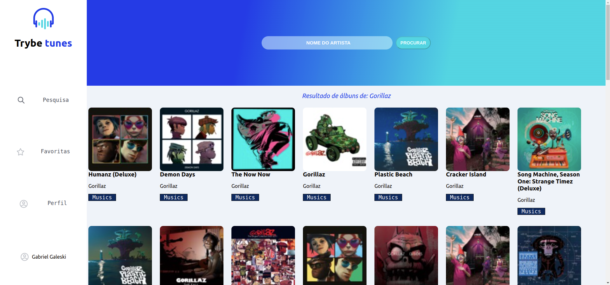
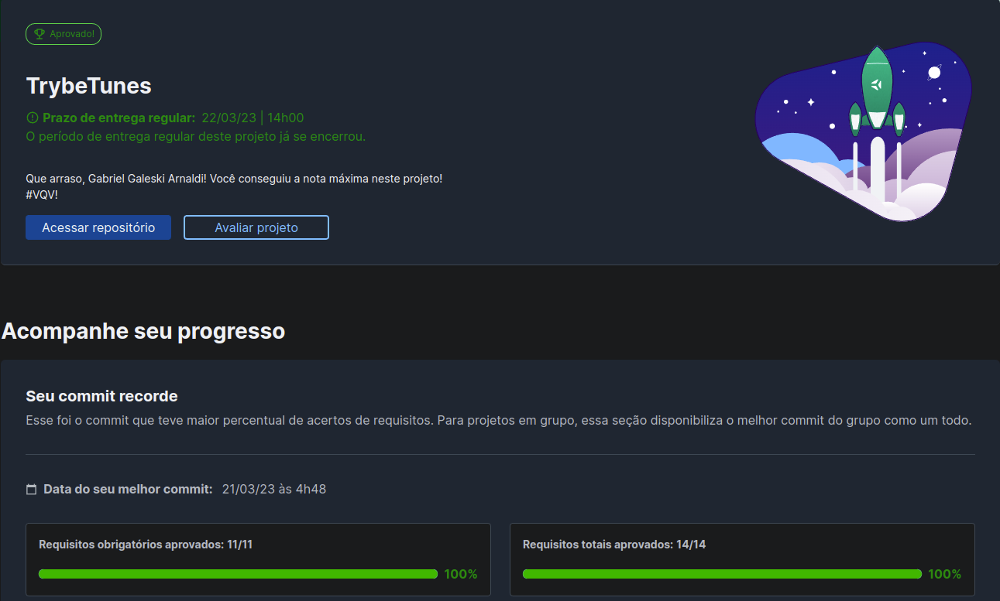

# :notes: Trybe Tunes! :notes:

 

# :camera_flash: Imagens do Projeto

  
<strong>Imagens</strong>
 
  
  
  

 

# :clipboard: About
Projeto Desenvolvido durante o curso da Trybe com foco na manipulação do React, com react rooters e outras ferramentas. A aplicação exige um login, onde apos ser concluido, vai para a pagina principal que contem as buscas por musica, as musicas favoritas e o perfil do usuario. È possivel adicionar musicas as favoritas, procurar por musicas ou artistas e modificar seu perfil.

 

# :hammer_and_wrench: Skills & Tools

- HTML5
- CSS3
- JavaScript ES6+
- React.js
- API

 

# :scroll: Nota

 
# :construction: To Implement :construction:

- Icon no favoritar / desfavoritas
